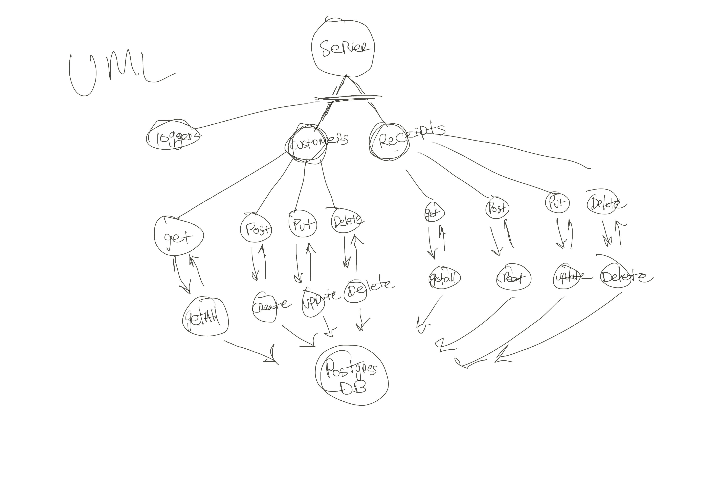

# api-server
Dynamic API Phase 3: Add Database Abstraction and Associations to your API

# class-04-DataModeling

Author: Tek Jones

Collection Interface which will consume a Sequelize Model and perform generic Database CRUD operations

Deployed Links: https://tekjones-api-server.herokuapp.com/

## UML

## Routes

### /customers

#### GET

- Status Code 200
- JSON response:
  - Returns and array of `customers` containing
    - breed: STRING
    - age: NUMBER

#### POST

- Status Code 200
- JSON response:
  - Creates a new `customers` item
  - Returns a newly created `customers` item containing:
    - breed: STRING
    - age: NUMBER

### /customers/:customersId

#### GET

- Status Code 200
- JSON response:
  - Returns a single instance `customers` based on the `customersId` containing:
    - breed: STRING
    - age: NUMBER

#### PUT

- Status Code 200
- JSON response:
  - Updates a single instance of `customers` based on the `customersId`, returns newly updated item containing:
    - breed: STRING
    - age: NUMBER

#### DELETE

- Status Code 204
- Removes a single instance of `customers` based on the `customersId`, no body:

---------------------------------------------

### /receipts

#### GET

- Status Code 200
- JSON response:
  - Returns and array of `receipts` containing
    - name: STRING
    - year: NUMBER

#### POST

- Status Code 200
- JSON response:
  - Creates a new `receipts` item
  - Returns a newly created `receipts` item containing:
    - name: STRING
    - year: NUMBER

### /customers/:customersId

#### GET

- Status Code 200
- JSON response:
  - Returns a single instance `receipts` based on the `receiptsId` containing:
    - name: STRING
    - year: NUMBER

#### PUT

- Status Code 200
- JSON response:
  - Updates a single instance of `receipts` based on the `receiptsId`, returns newly updated item containing:
    - name: STRING
    - year: NUMBER

#### DELETE

- Status Code 204
- Removes a single instance of `receipts` based on the `receiptsId`, no body: